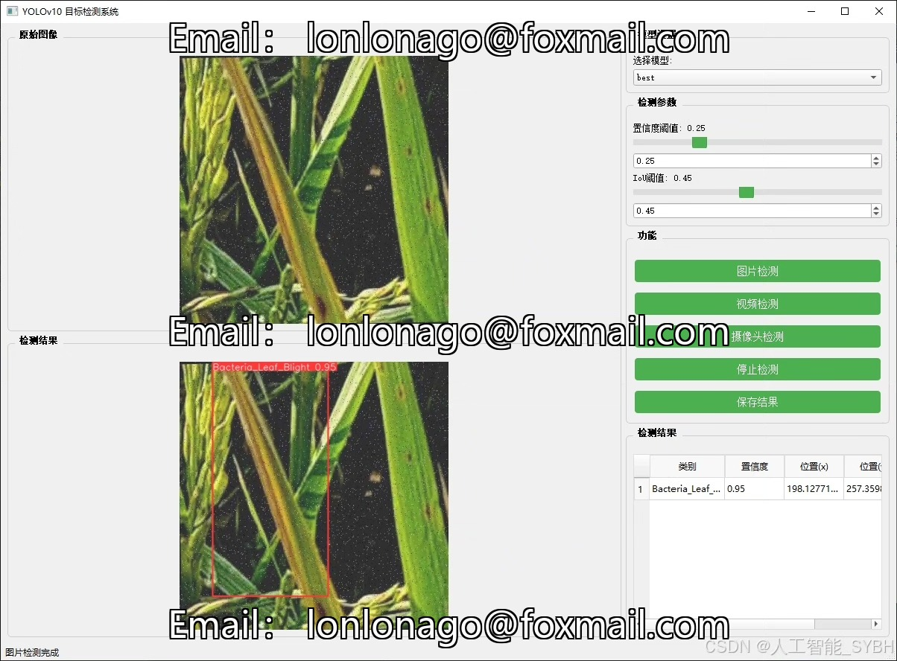
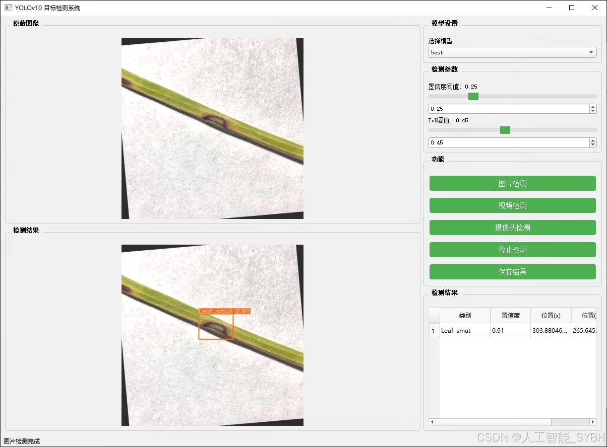
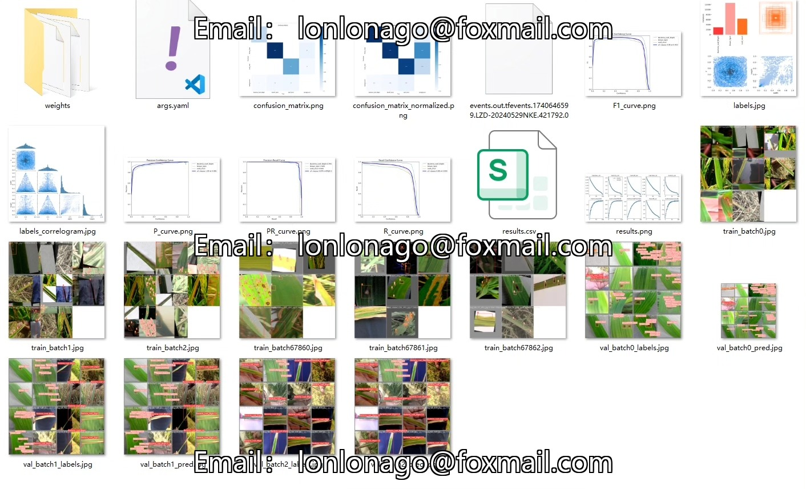
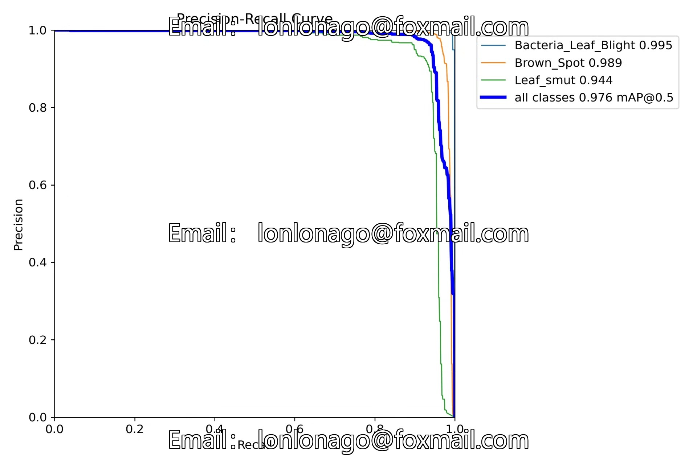
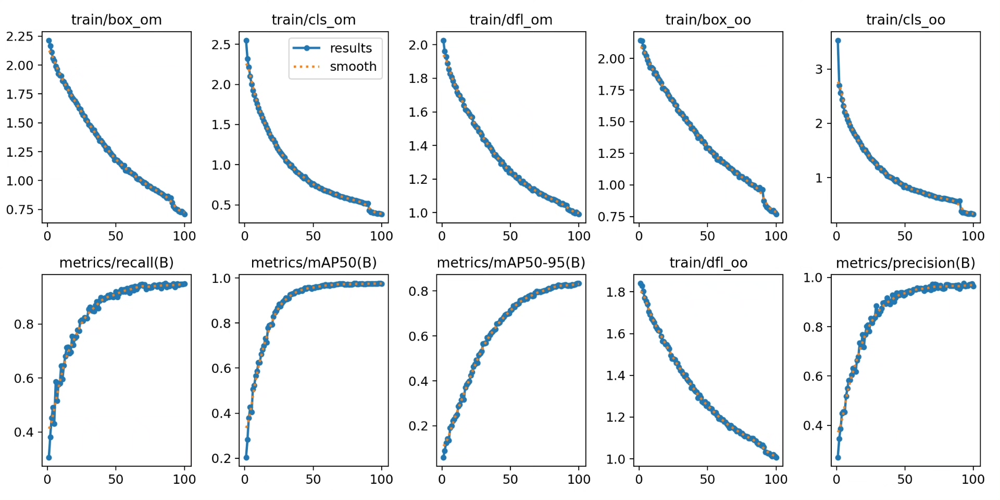
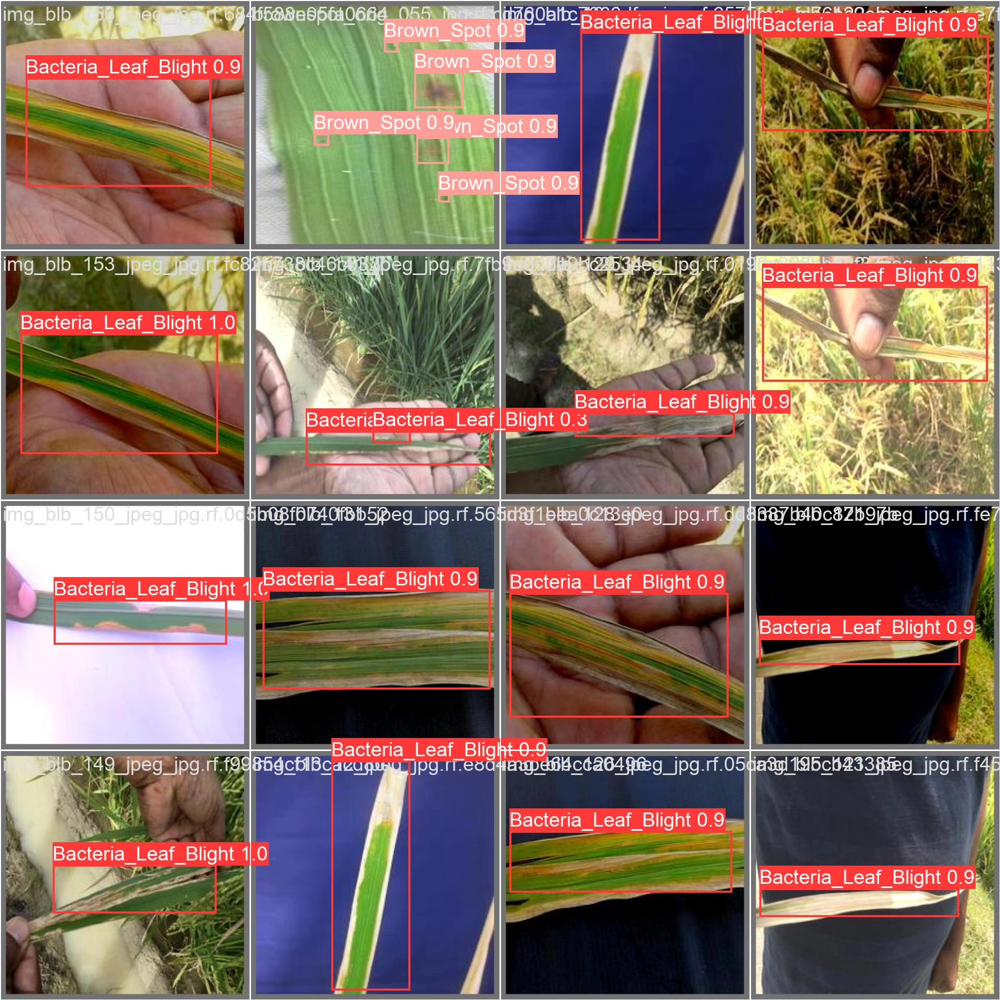
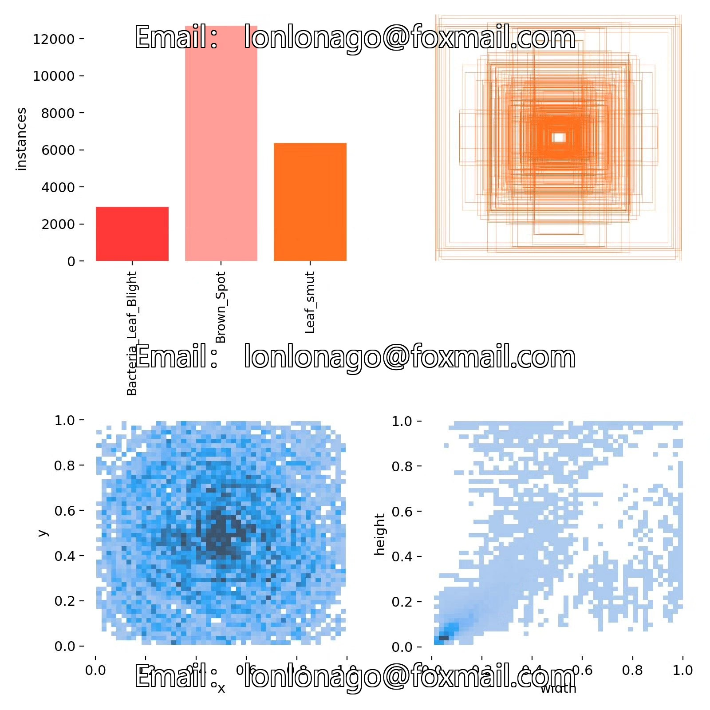
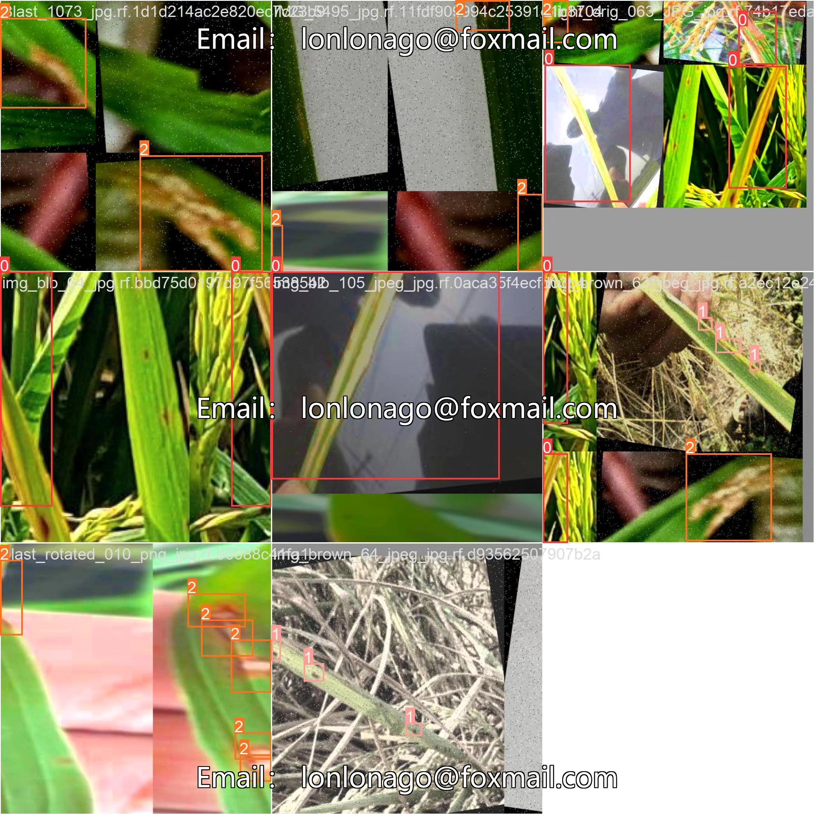

# Rice Disease Detection System Based on YOLOv10 Deep Learning

## Body

Based on the YOLOv10 deep learning algorithm, we have developed a high-efficiency rice disease detection system. This system can automatically detect and classify diseases in rice leaf images, providing planters with disease early warnings and prevention suggestions.

Our company's products have been granted commercial license certification from YOLO.

We provide after-sales service.

After payment, we will provide WeChat ID for any questions.

Environmental configuration: We will provide an instruction manual for setting up the environment, and WeChat will provide answers to questions.

Remote installation service: If you need remote configuration, an additional fee of 69 is required. If the configuration fails, all fees will be refunded (only the installation fee will be refunded for older computers).

Retraining dataset: After setting up the environment, you can train on your own computer. If you need us to retrain, just pay 69 plus computing power fees (2.5 yuan/hour).

Full after-sales service

## Images

## Payment

Here is a pay link on Stripe ( https://buy.stripe.com/3cs8yP7sY87d0vu9AB ). Please contact me lonlonago@foxmail.com after funding $89, and I will send you a complete data files , thank you!

